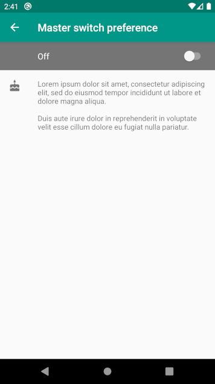
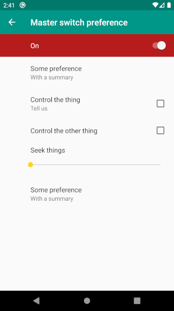

# MasterSwitchPreference

[](https://jitpack.io/#svenoaks/MasterSwitchPreference)

MasterSwitchPreference provides an AndroidX implementation of two patterns found in the [Material Design guidelines for Android settings](https://material.io/design/platform-guidance/android-settings.html#label-and-secondary-text). 

  - **Master on and off switch**

> *Use this pattern when you need a mechanism to turn off an entire category of settings.*
> 
> *An on/off switch is placed as the first item in the action bar of a subscreen. When the switch is turned off, the items in the list disappear, replaced by text that describes while the list is empty.*

  - **Individual on/off switch**

> *Use this pattern for an individual setting that requires a more elaborate description than can be provided in checkbox form.*
> 
> *The on/off switch only appears in the subscreen so that users can only toggle it while viewing its descriptive text. Secondary text appears below the setting label to reflect the current selection.*

&nbsp;&nbsp;&nbsp;&nbsp;&nbsp;&nbsp;   

The library also provides the preference to place in your root Settings screen, which is where you would typically configure the subscreen with the master switch as well:

```
<PreferenceScreen xmlns:android="http://schemas.android.com/apk/res/android"
    xmlns:app="http://schemas.android.com/apk/res-auto">
    
    <!--Typical configuration for master on/off switch-->
    <com.smp.masterswitchpreference.MasterSwitchPreference
        app:defaultValue="false"
        app:icon="@drawable/ic_baseline_cake_24"
        app:key="@string/some_key"
        app:summary="Everything hides"
        app:title="@string/title_master_switch"
        app:ms_switchThumbColor="@color/md_grey_50"
        app:ms_switchTrackColor="@color/switch_track_color"
        app:ms_switchOffText="Off"
        app:ms_switchOnText="On"
        app:ms_switchOffBackgroundColor="@color/md_grey_600"
        app:ms_switchOnBackgroundColor="@color/md_red_900"
        app:ms_switchTextColor="@android:color/primary_text_dark"
        app:ms_switchOffExplanationText="@string/off_explanation"
        app:ms_explanationIcon="@drawable/ic_baseline_cake_24"
        app:ms_includedPrefScreen="@xml/settings_master_switch_1" />

    <!--Typical configuration for individual on/off switch-->
    <com.smp.masterswitchpreference.MasterSwitchPreference
        app:defaultValue="false"
        app:icon="@drawable/ic_baseline_cake_24"
        app:key="@string/some_individual_key"
        app:summary="Some of them don't hide"
        app:title="Individual on/off switch"
        app:ms_switchThumbColor="@color/md_grey_50"
        app:ms_switchTrackColor="@color/switch_track_color"
        app:ms_switchOffText="Off"
        app:ms_switchOnText="On"
        app:ms_switchOffBackgroundColor="@color/md_grey_600"
        app:ms_switchOnBackgroundColor="@color/md_red_900"
        app:ms_switchTextColor="@android:color/primary_text_dark"
        app:ms_switchOffExplanationText="@string/off_explanation"
        app:ms_switchOnExplanationText="@string/on_explanation"
        app:ms_explanationIcon="@drawable/ic_baseline_cake_24"
        app:ms_hideExplanation="false"
        app:ms_showStatusInSummary="true"/>

    ...

</PreferenceScreen>

```

There are examples in the sample app for various configurations, including:

  - How to extend `MasterSwitchPreferenceFragment` in case you need to do things like bind summaries to values.
  - Inlucde preferences in the master switch screen which never hide.
  - Use `MasterSwitchPreferenceFragment` directly without going through Settings.
  - Use the library with the Navigation component.
  

```
	dependencies {
	        implementation 'com.github.svenoaks:MasterSwitchPreference:0.9.1'
	}

```
